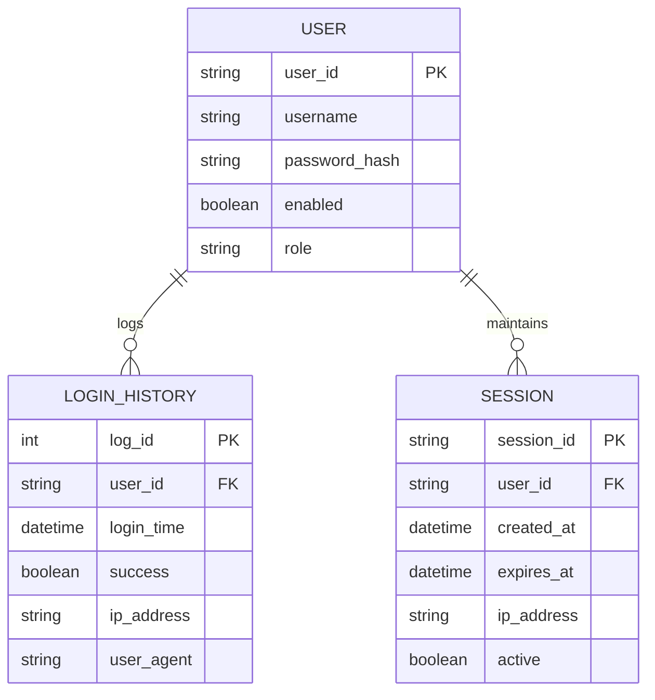

```mermaid
erDiagram
    USER ||--o{ LOGIN_HISTORY : logs
    USER ||--o{ SESSION : maintains

    USER {
        string user_id PK
        string username
        string password_hash
        boolean enabled
        string role
    }

    LOGIN_HISTORY {
        int log_id PK
        string user_id FK
        datetime login_time
        boolean success
        string ip_address
        string user_agent
    }

    SESSION {
        string session_id PK
        string user_id FK
        datetime created_at
        datetime expires_at
        string ip_address
        boolean active
    }

```