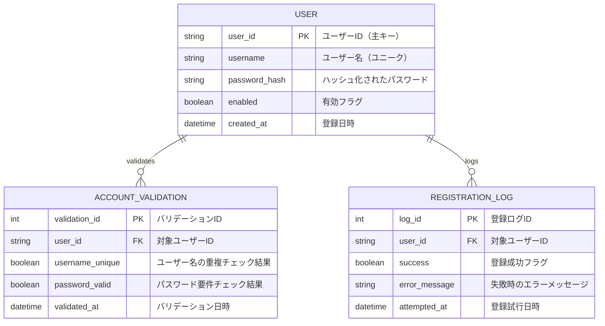

```mermaid

erDiagram
    USER ||--o{ ACCOUNT_VALIDATION : validates
    USER ||--o{ REGISTRATION_LOG : logs

    USER {
        string user_id PK "ユーザーID（主キー）"
        string username "ユーザー名（ユニーク）"
        string password_hash "ハッシュ化されたパスワード"
        boolean enabled "有効フラグ"
        datetime created_at "登録日時"
    }

    ACCOUNT_VALIDATION {
        int validation_id PK "バリデーションID"
        string user_id FK "対象ユーザーID"
        boolean username_unique "ユーザー名の重複チェック結果"
        boolean password_valid "パスワード要件チェック結果"
        datetime validated_at "バリデーション日時"
    }

    REGISTRATION_LOG {
        int log_id PK "登録ログID"
        string user_id FK "対象ユーザーID"
        boolean success "登録成功フラグ"
        string error_message "失敗時のエラーメッセージ"
        datetime attempted_at "登録試行日時"
    }

```
