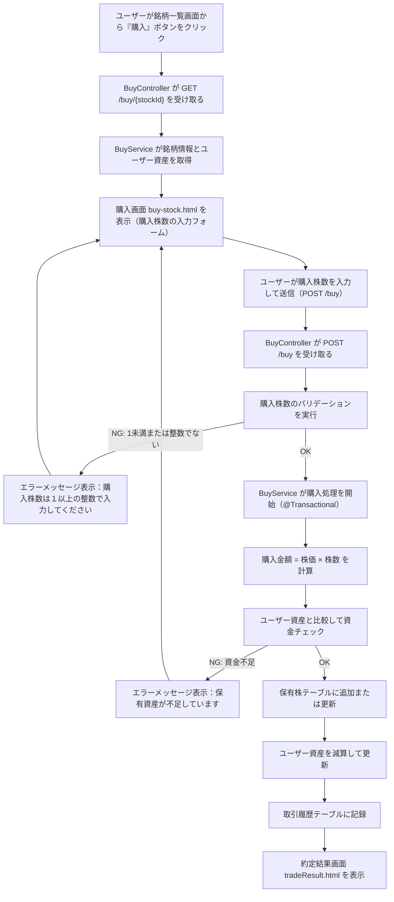

```mermaid
flowchart TD

A["ユーザーが銘柄一覧画面から『購入』ボタンをクリック"] --> B["BuyController が GET /buy/{stockId} を受け取る"]
    B --> C["BuyService が銘柄情報とユーザー資産を取得"]
    C --> D["購入画面 buy-stock.html を表示（購入株数の入力フォーム）"]

    D --> E["ユーザーが購入株数を入力して送信（POST /buy）"]
    E --> F["BuyController が POST /buy を受け取る"]
    F --> G["購入株数のバリデーションを実行"]

    G -->|NG: 1未満または整数でない| H["エラーメッセージ表示：購入株数は１以上の整数で入力してください"]
    H --> D

    G -->|OK| I["BuyService が購入処理を開始（@Transactional）"]
    I --> J["購入金額 = 株価 × 株数 を計算"]
    J --> K["ユーザー資産と比較して資金チェック"]

    K -->|NG: 資金不足| L["エラーメッセージ表示：保有資産が不足しています"]
    L --> D

    K -->|OK| M["保有株テーブルに追加または更新"]
    M --> N["ユーザー資産を減算して更新"]
    N --> O["取引履歴テーブルに記録"]
    O --> P["約定結果画面 tradeResult.html を表示"]

```