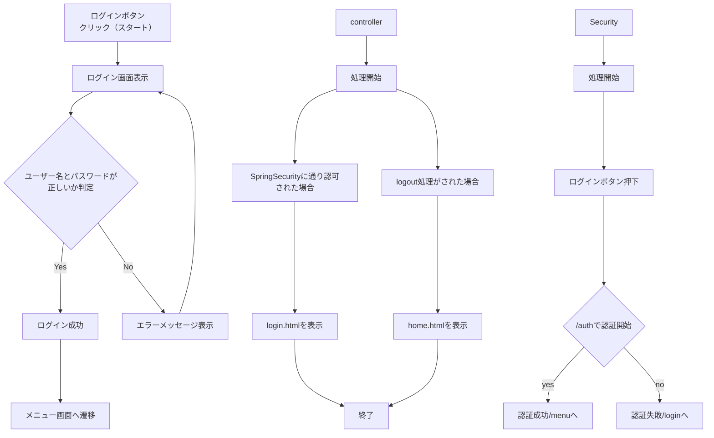

```mermaid
flowchart TD
A[ログインボタン
クリック（スタート）]-->B[ログイン画面表示];
B --> c{ユーザー名とパスワードが正しいか判定};
c -- Yes --> D[ログイン成功];
c -- No --> E[エラーメッセージ表示];
D --> f[メニュー画面へ遷移];
E --> B;

controller --> a[処理開始];
a[処理開始] --> SpringSecurityに通り認可された場合;
SpringSecurityに通り認可された場合 --> login.htmlを表示;
a[処理開始] --> logout処理がされた場合; 
logout処理がされた場合 --> home.htmlを表示;
login.htmlを表示 --> 終了;
home.htmlを表示 --> 終了

Security --> se[処理開始];
se[処理開始] --> 1[ログインボタン押下];
1[ログインボタン押下] --> 2{/authで認証開始};
2{/authで認証開始} -- yes --> 認証成功/menuへ;
2{/authで認証開始} -- no --> 認証失敗/loginへ;


``` 
