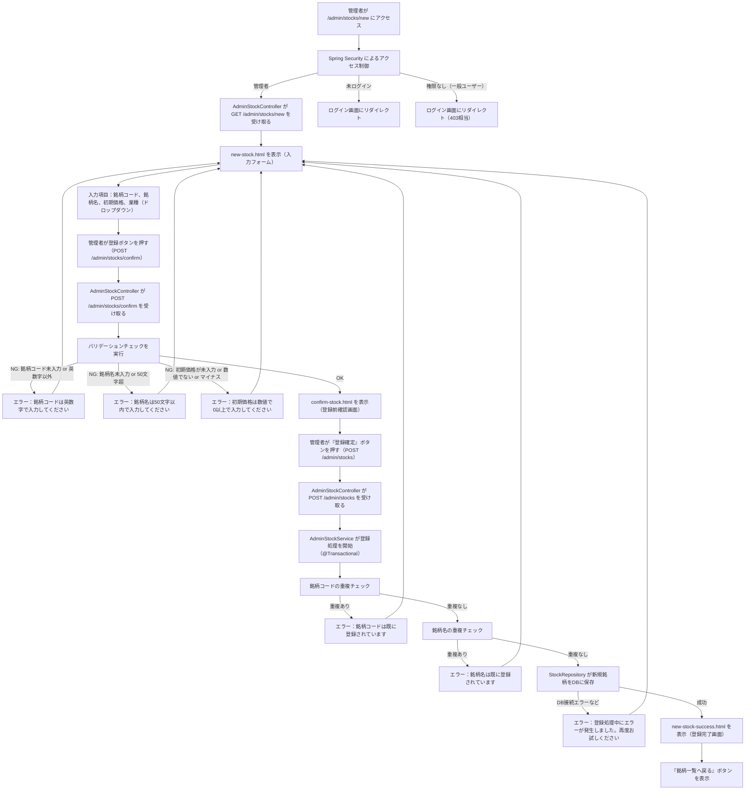

```mermaid
flowchart TD
    1["管理者が /admin/stocks/new にアクセス"] --> 2["Spring Security によるアクセス制御"]

    %% アクセス制御分岐
    2 -->|未ログイン| 98["ログイン画面にリダイレクト"]
    2 -->|権限なし（一般ユーザー）| 99["ログイン画面にリダイレクト（403相当）"]
    2 -->|管理者| 3["AdminStockController が GET /admin/stocks/new を受け取る"]

    %% 入力フォーム表示
    3 --> 4["new-stock.html を表示（入力フォーム）"]
    4 --> 5["入力項目：銘柄コード、銘柄名、初期価格、業種（ドロップダウン）"]
    5 --> 6["管理者が登録ボタンを押す（POST /admin/stocks/confirm）"]

    %% バリデーション処理
    6 --> 7["AdminStockController が POST /admin/stocks/confirm を受け取る"]
    7 --> 8["バリデーションチェックを実行"]

    8 -->|NG: 銘柄コード未入力 or 英数字以外| 10["エラー：銘柄コードは英数字で入力してください"]
    8 -->|NG: 銘柄名未入力 or 50文字超| 11["エラー：銘柄名は50文字以内で入力してください"]
    8 -->|NG: 初期価格が未入力 or 数値でない or マイナス| 12["エラー：初期価格は数値で0以上で入力してください"]
    10 --> 4
    11 --> 4
    12 --> 4

    8 -->|OK| 13["confirm-stock.html を表示（登録前確認画面）"]
    13 --> 14["管理者が『登録確定』ボタンを押す（POST /admin/stocks）"]

    %% 登録処理
    14 --> 15["AdminStockController が POST /admin/stocks を受け取る"]
    15 --> 16["AdminStockService が登録処理を開始（@Transactional）"]

    %% 重複チェック
    16 --> 17["銘柄コードの重複チェック"]
    17 -->|重複あり| 18["エラー：銘柄コードは既に登録されています"]
    18 --> 4

    17 -->|重複なし| 19["銘柄名の重複チェック"]
    19 -->|重複あり| 20["エラー：銘柄名は既に登録されています"]
    20 --> 4

    19 -->|重複なし| 21["StockRepository が新規銘柄をDBに保存"]

    %% DBエラー処理
    21 -->|DB接続エラーなど| 22["エラー：登録処理中にエラーが発生しました。再度お試しください"]
    22 --> 4

    21 -->|成功| 23["new-stock-success.html を表示（登録完了画面）"]
    23 --> 24["『銘柄一覧へ戻る』ボタンを表示"]

```