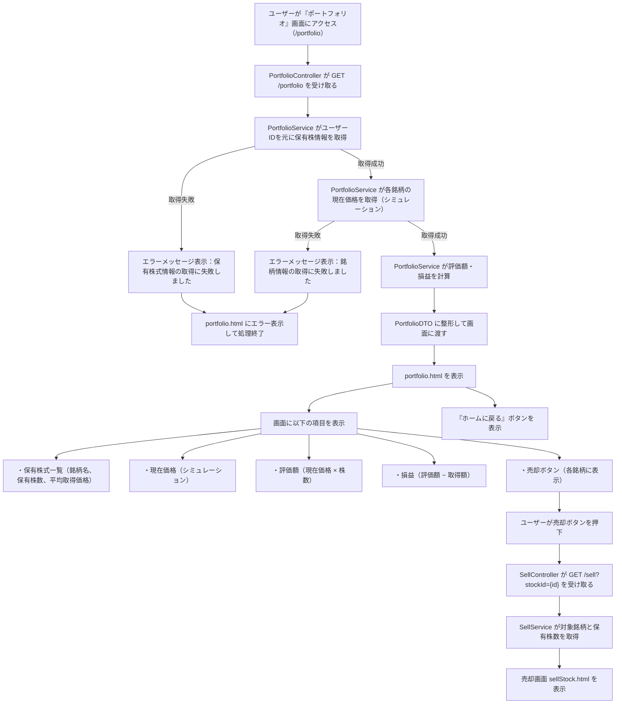

```mermaid
flowchart TD

    1["ユーザーが『ポートフォリオ』画面にアクセス（/portfolio）"] --> 2["PortfolioController が GET /portfolio を受け取る"]
    2 --> 3["PortfolioService がユーザーIDを元に保有株情報を取得"]

    3 -->|取得失敗| 4["エラーメッセージ表示：保有株式情報の取得に失敗しました"]
    4 --> 5["portfolio.html にエラー表示して処理終了"]

    3 -->|取得成功| 6["PortfolioService が各銘柄の現在価格を取得（シミュレーション）"]

    6 -->|取得失敗| 7["エラーメッセージ表示：銘柄情報の取得に失敗しました"]
    7 --> 5

    6 -->|取得成功| 8["PortfolioService が評価額・損益を計算"]
    8 --> 9["PortfolioDTO に整形して画面に渡す"]
    9 --> 10["portfolio.html を表示"]

    10 --> 11["画面に以下の項目を表示"]
    11 --> 12["・保有株式一覧（銘柄名、保有株数、平均取得価格）"]
    11 --> 13["・現在価格（シミュレーション）"]
    11 --> 14["・評価額（現在価格 × 株数）"]
    11 --> 15["・損益（評価額 − 取得額）"]
    11 --> 16["・売却ボタン（各銘柄に表示）"]
    10 --> 17["『ホームに戻る』ボタンを表示"]

    16 --> 18["ユーザーが売却ボタンを押下"]
    18 --> 19["SellController が GET /sell?stockId={id} を受け取る"]
    19 --> 20["SellService が対象銘柄と保有株数を取得"]
    20 --> 21["売却画面 sellStock.html を表示"]

```