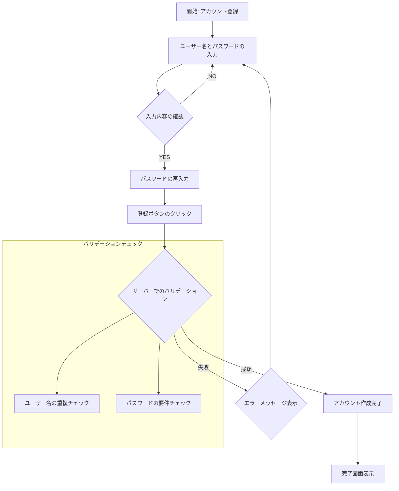

```mermaid

flowchart TD
    A[開始: アカウント登録] --> B[ユーザー名とパスワードの入力];
    B --> C{入力内容の確認};
    C -- YES --> D[パスワードの再入力];
    C -- NO --> B;
    D --> F[登録ボタンのクリック];
    F --> G{サーバーでのバリデーション};
    G -- 成功 --> H[アカウント作成完了];
    G -- 失敗 --> I{エラーメッセージ表示};
    H --> J[完了画面表示];
    I --> B;

    subgraph バリデーションチェック
        direction TB
        G --> K[ユーザー名の重複チェック];
        G --> L[パスワードの要件チェック];
    end
```
