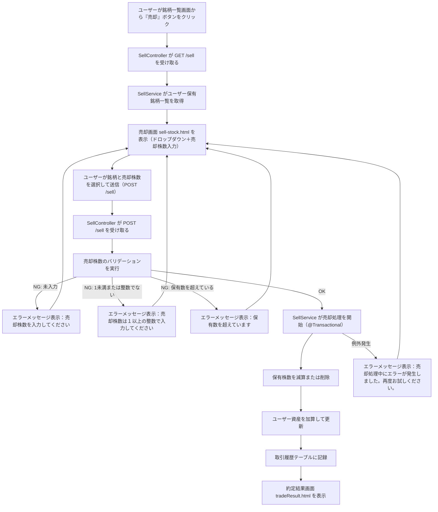

```mermaid
flowchart TB

A["ユーザーが銘柄一覧画面から『売却』ボタンをクリック"] --> B["SellController が GET /sell を受け取る"]
    B --> C["SellService がユーザー保有銘柄一覧を取得"]
    C --> D["売却画面 sell-stock.html を表示（ドロップダウン＋売却株数入力）"]

    D --> E["ユーザーが銘柄と売却株数を選択して送信（POST /sell）"]
    E --> F["SellController が POST /sell を受け取る"]
    F --> G["売却株数のバリデーションを実行"]

    G -->|NG: 未入力| H["エラーメッセージ表示：売却株数を入力してください"]
    G -->|NG: 1未満または整数でない| I["エラーメッセージ表示：売却株数は１以上の整数で入力してください"]
    G -->|NG: 保有数を超えている| J["エラーメッセージ表示：保有数を超えています"]
    H --> D
    I --> D
    J --> D

    G -->|OK| K["SellService が売却処理を開始（@Transactional）"]
    K --> L["保有株数を減算または削除"]
    L --> M["ユーザー資産を加算して更新"]
    M --> N["取引履歴テーブルに記録"]
    N --> O["約定結果画面 tradeResult.html を表示"]

    K -->|例外発生| P["エラーメッセージ表示：売却処理中にエラーが発生しました。再度お試しください。"]
    P --> D

```