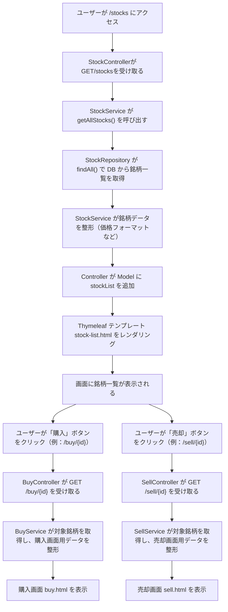

```mermaid

flowchart TD
  
  A["ユーザーが /stocks にアクセス"] --> B["StockControllerがGET/stocksを受け取る"]
    B --> C["StockService が getAllStocks() を呼び出す"]
    C --> D["StockRepository が findAll() で DB から銘柄一覧を取得"]
    D --> E["StockService が銘柄データを整形（価格フォーマットなど）"]
    E --> F["Controller が Model に stockList を追加"]
    F --> G["Thymeleaf テンプレート stock-list.html をレンダリング"]
    G --> H["画面に銘柄一覧が表示される"]

    H --> I["ユーザーが「購入」ボタンをクリック（例：/buy/{id}）"]
    H --> J["ユーザーが「売却」ボタンをクリック（例：/sell/{id}）"]

    I --> K["BuyController が GET /buy/{id} を受け取る"]
    K --> L["BuyService が対象銘柄を取得し、購入画面用データを整形"]
    L --> M["購入画面 buy.html を表示"]

    J --> N["SellController が GET /sell/{id} を受け取る"]
    N --> O["SellService が対象銘柄を取得し、売却画面用データを整形"]
    O --> P["売却画面 sell.html を表示"]


```