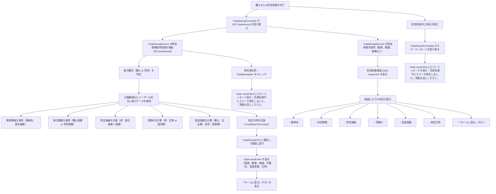

```mermaid
flowchart TD
    A["購入または売却処理が完了"] --> B["TradeResultController が GET /trade/result を受け取る"]
    B --> C["TradeResultService が約定情報を取得（銘柄、数量、価格など）"]
    C --> D["約定結果画面 trade-result.html を表示"]

    D --> E["画面に以下の項目を表示"]
    E --> F["・銘柄名"]
    E --> G["・約定株数"]
    E --> H["・約定価格"]
    E --> I["・手数料"]
    E --> J["・受渡金額"]
    E --> K["・約定日時"]
    E --> L["・『ホームに戻る』ボタン"]

    A --> M["約定処理中に例外が発生"] --> N["TradeResultController がエラーメッセージを受け取る"]
    N --> O["trade-result.html にエラーメッセージを表示：売却処理中にエラーが発生しました。再度お試しください。"]

   
   
    B["TradeResultController が GET /trade/result を受け取る"]
    B --> 2["TradeResultService が約定情報取得処理を開始（@Transactional）"]

    2 --> 3["取引種別（購入 or 売却）を判定"]
    3 --> 4["対象銘柄IDとユーザーIDを元に取引データを取得"]

    4 --> 5["銘柄情報を取得（銘柄名、現在価格）"]
    4 --> 6["取引数量を取得（購入株数 or 売却株数）"]
    4 --> 7["約定価格を計算（例：現在価格 × 株数）"]
    4 --> 8["手数料を計算（例：定率 or 固定額）"]
    4 --> 9["受渡金額を計算（購入：支払額、売却：受取額）"]
    4 --> 10["約定日時を記録（LocalDateTime.now()）"]

    10 --> 11["TradeResultDTO に整形して画面に渡す"]
    11 --> 12["trade-result.html を表示（銘柄、数量、価格、手数料、受渡金額、日時）"]
    12 --> 13["『ホームに戻る』ボタンを表示"]

    2 --> 14["例外発生時：TradeException をキャッチ"]
    14 --> 15["trade-result.html にエラーメッセージ表示：売却処理中にエラーが発生しました。再度お試しください。"]


```